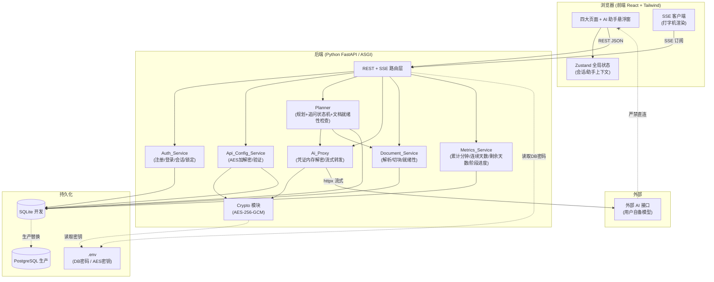
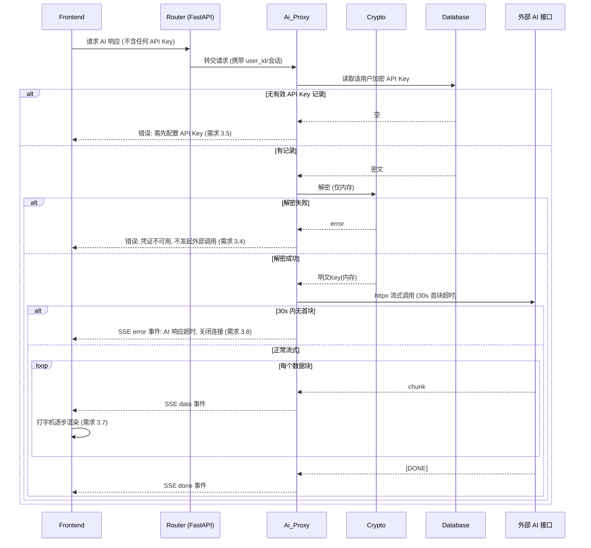
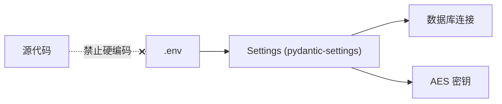
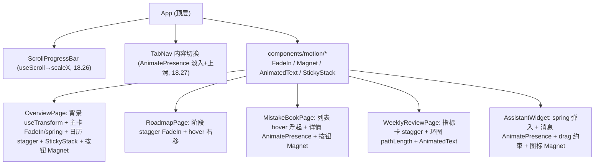
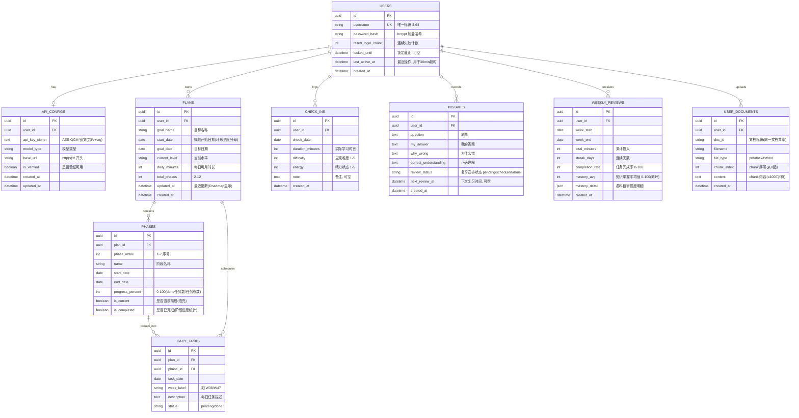
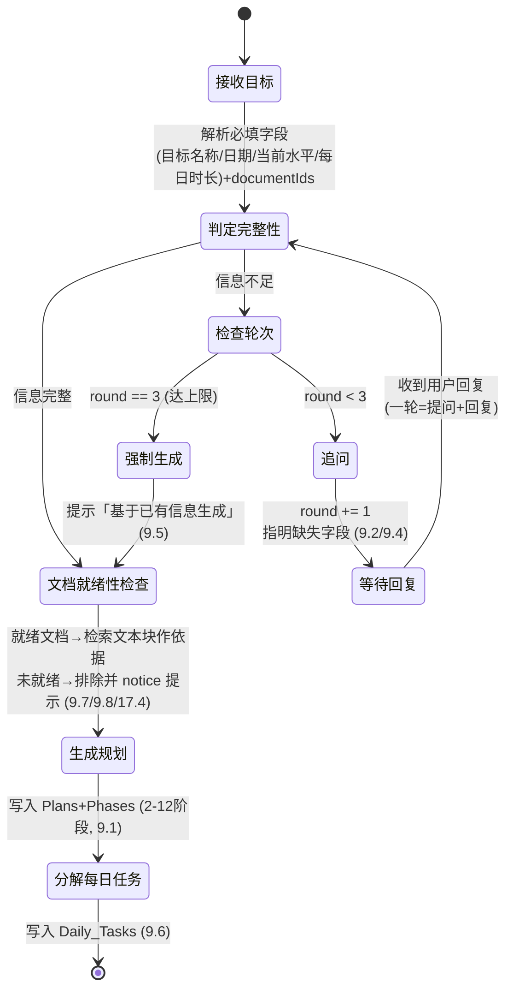
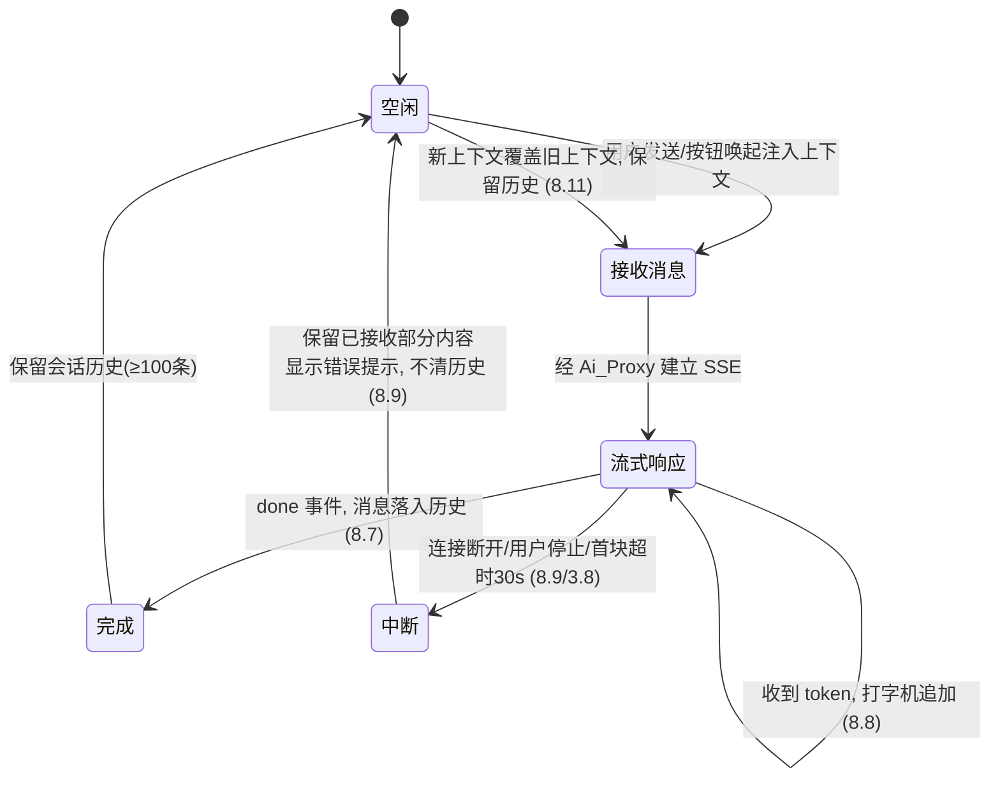

# 设计文档

## Overview

StudyPilot 是一款前后端分离的 AI 学习规划 Web 应用。本设计文档基于 `requirements.md` 中的 18 条需求，给出可落地的技术方案，覆盖整体架构、前端组件树、数据库设计、后端接口、AI Agent 状态机、安全设计、交互动效与正确性属性。

设计目标（与需求映射）：

- 用户认证与会话安全（需求 1）
- AI API 配置（含更新 / 删除）与 AES 加密存储（需求 2、11、14）
- AI 安全代理与 SSE 流式通信（需求 3）
- 四大页面 UI/UX（需求 4、5、6、7）
- AI 助手悬浮窗（全局悬浮助手）（需求 8）
- AI 规划、三轮追问边界与文档驱动（需求 9、17）
- 规划中途修改（需求 10）
- 数据存储与文档切块（需求 11）
- 视觉设计系统与响应式布局（需求 12、13）
- 技术架构与安全约束（需求 14）
- 学习指标计算口径（需求 15）
- 每日任务状态与进度联动（需求 16）
- 交互动效与高级动画（需求 18）

### 环形进度口径（需求 4.1）

总览页主卡片的环形进度条表示「备考时间流逝百分比」，其计算口径为：

```
ring = (today - plan.start_date) / (goal_date - plan.start_date) × 100%
ring = clamp(ring, 0, 100)          // 约束在 0 至 100 之间
```

- 分子为已流逝天数，分母为规划总跨度天数；当 `today < start_date` 时 clamp 到 0，`today > goal_date` 时 clamp 到 100。
- 该口径需要规划的显式起始日期，故在 Data Models 的 Plans 表新增 `start_date` 字段（见 Data Models）。
- 所有自然日边界以用户本地日期为准（与需求 15.6 一致）。

### 技术选型概览

| 层 | 选型 | 说明 |
|----|------|------|
| 前端 | React 18 + Vite + Tailwind CSS + Zustand | 需求 14.1 允许 React/Vue，选 React（生态成熟、SSE/流式渲染库支持好、Zustand 轻量全局状态便于 AI 助手悬浮窗跨组件唤起） |
| 后端 | Python 3.11 + FastAPI + Uvicorn | 见下方选型理由（需求 14.2） |
| 数据库 | 开发 SQLite / 生产 PostgreSQL（SQLAlchemy ORM） | 需求 14.3；ORM 屏蔽方言差异，一套模型两种后端 |
| ORM/迁移 | SQLAlchemy 2.x + Alembic | 统一 schema，迁移可控 |
| 加密 | `cryptography` 库 AES-256-GCM | 需求 2.8、14.6 |
| 密码哈希 | `passlib` + bcrypt（自带盐） | 需求 1.10 |
| 配置 | `pydantic-settings` 读取 `.env` | 需求 14.4、14.5 |
| AI 调用 | `httpx`（异步、流式） | Ai_Proxy 转发外部 AI 接口 |
| 动效库 | `framer-motion` ^12.38.0 | 需求 18；入场 / 手势 / 滚动驱动动画，前端 `package.json` 需加入该依赖 |
| 图标库 | `lucide-react` ^0.344.0 | 前端统一图标，前端 `package.json` 需加入该依赖 |

> **前端依赖新增**：`frontend/package.json` 的 `dependencies` 需加入 `"framer-motion": "^12.38.0"` 与 `"lucide-react": "^0.344.0"` 两项，以支撑需求 18 的 Motion_Library 与图标。

**动效技术策略（需求 18）：** 前端基于 Framer Motion 构建可复用的动效组件库（Motion_Library），核心 API 组合为：

- `whileInView` + `viewport`：元素进入视口一次性触发入场（需求 18.1～18.3、18.11、18.12、18.19）。
- `useScroll` + `useTransform`：滚动进度驱动背景色渐变、视差位移、逐字显字、顶部进度条（需求 18.7、18.10、18.13、18.26）。
- `useSpring`：数字 / 环形进度弹性呈现、悬浮窗弹入（需求 18.11、18.22）。
- `AnimatePresence`：错题详情切换、消息进出场、Tab 切换的进退场动画（需求 18.18、18.23、18.27）。
- `drag` + `dragConstraints`：AI 助手悬浮窗拖拽约束（需求 18.25）。
- 动画元素通过 `motion.create()` 动态生成（如 `motion.create('div')`、`motion.create(Icon)`）。

该策略在保持需求 12 视觉系统（浅色、薄荷绿主色、卡片式、圆角与阴影）与需求 13 响应式布局的前提下实现，动效仅增强既有 UI，不改变原有配色、圆角、阴影与栅格断点（需求 18.29）。

**后端选型理由（Python FastAPI）：** 需求 14.2 允许 Node.js 或 Python(FastAPI)，本设计选择 **Python + FastAPI**，原因：

1. **原生异步与 SSE 友好**：FastAPI 基于 ASGI，`StreamingResponse` + 异步生成器可自然实现需求 3.6～3.10 的 SSE 流式转发与中断处理。
2. **AI 生态**：Python 拥有最成熟的文档解析（`pypdf`、`python-docx`）与文本处理库，便于实现需求 11 的文档解析与切块。
3. **数据校验内建**：Pydantic 提供请求/响应模型校验，天然满足需求 1、2 的字段校验约束。
4. **加密与安全库成熟**：`cryptography`、`passlib` 直接覆盖 AES 与加盐哈希要求。

## Architecture

### 系统架构图



> 关键约束：前端**严禁**直连外部 AI 接口（需求 3.1、14.7），图中以 `严禁直连` 标出。所有外部 AI 调用必须经 `Ai_Proxy`。

### AI 调用链路



**链路要点：**

- 前端请求体**不包含**任何 API Key 或凭证字段（需求 3.1）。
- API Key 在 DB 中为 AES 密文，`Ai_Proxy` 读取后经 `Crypto` 解密，**仅在后端进程内存**中用于外部调用，不落任何日志、不写入响应体/响应头（需求 2.8、3.2、3.3）。
- 所有 AI 响应（AI 助手悬浮窗与 Planner）经 SSE 流式推送（需求 3.6）。

### 部署与配置（.env）

- `.env` 存放：`DB_PASSWORD`、`DATABASE_URL`、`AES_KEY`（Base64 编码的 32 字节密钥）、`SESSION_TIMEOUT_MINUTES` 等。
- 通过 `pydantic-settings` 的 `Settings` 类集中加载；源代码中**不得**出现明文数据库密码或 AES 密钥（需求 14.4、14.5）。
- 提供 `.env.example` 模板，真实 `.env` 加入 `.gitignore`。



## Components and Interfaces

### 前端组件树

```mermaid
graph TD
    App["App (顶层, 会话守卫)"]
    App --> Header["Header<br/>(左上圆形序号+目标标题/副标题, 右上「本地学习中/学习者」)"]
    App --> TabNav["TabNav (顶部居中 Tab 导航)"]
    App --> Pages["页面容器 (按 Tab 路由)"]
    App --> Assistant["AssistantWidget (全局悬浮窗)"]
    App --> LoginModal["Auth (注册/登录)"]
    App --> SettingsModal["ApiConfigForm (API 配置设置)"]

    TabNav --> T1["总览"]
    TabNav --> T2["Roadmap"]
    TabNav --> T3["错题本"]
    TabNav --> T4["本周复盘"]

    Pages --> Overview["OverviewPage"]
    Pages --> Roadmap["RoadmapPage"]
    Pages --> Mistake["MistakeBookPage"]
    Pages --> Weekly["WeeklyReviewPage"]

    Overview --> GoalCard["GoalCard (目标标题/副标题/环形进度=时间流逝%)"]
    Overview --> MetricsRow["MetricsRow (剩余天数/累计分钟/连续天数/阶段x7, 源自 Metrics_Service)"]
    Overview --> WeekCalendar["WeekCalendar (横向滚动本周日历)"]
    Overview --> TaskCard["TodayTaskCard (绿底/今日三态: 未反馈/已安排/已完成/开始学习)"]
    Overview --> CheckInForm["CheckInForm (时长快捷60/75/90+难度+精力+备注)"]

    App --> GoalSubmit["GoalSubmitForm (学习目标提交界面)"]
    GoalSubmit --> DocumentPicker["DocumentPicker (列出 User_Documents, 多选, 标注「尚未就绪」)"]

    Roadmap --> RoadmapHeader["RoadmapHeader (标题+更新时间戳)"]
    Roadmap --> PhaseCards["PhaseCardList (阶段1-7, 当前阶段高亮)"]
    Roadmap --> WeekTaskGroups["WeekTaskGroups (按 W38/W47 分组)"]

    Mistake --> MistakeList["MistakeList (左栏, 待复习角标)"]
    Mistake --> MistakeDetail["MistakeDetail (右栏)"]
    MistakeDetail --> QCard["原题卡片 (黑底白字)"]
    MistakeDetail --> MyAnsCard["我的答案 (红底)"]
    MistakeDetail --> WhyCard["为什么错"]
    MistakeDetail --> CorrectCard["正确理解 (绿底)"]
    MistakeDetail --> ReviewStatus["复习安排状态"]
    MistakeDetail --> ToAssistantBtn["「回到学习助手重新做一道」按钮"]

    Weekly --> EmptyState["空状态提示 (未满一周)"]
    Weekly --> PurpleRing["紫色环形图 (知识掌握平均值)"]
    Weekly --> WeeklyMetrics["数据卡 (累计投入/连续天数/任务完成率)"]
    Weekly --> MasteryDetail["知识掌握明细 (进度条)"]

    Assistant --> FloatIcon["FloatingIcon (可拖拽图标)"]
    Assistant --> ChatWindow["ChatWindow (消息列表+输入框)"]
    ChatWindow --> MsgList["MessageList (打字机流式渲染)"]
```



#### 全局状态管理（Zustand）

AI 助手悬浮窗需要被页面各处按钮唤起并注入上下文（需求 6.6、8.10、8.11），使用 **Zustand** 建立全局 store，避免深层 prop 透传：

```ts
interface AppStore {
  // 会话
  session: { userId: string; expiresAt: number } | null;
  // AI 助手悬浮窗状态
  assistant: {
    open: boolean;
    position: { x: number; y: number };   // 图标位置
    context: AssistantContext | null;       // 注入的上下文（如错题）
    messages: Message[];                    // 会话历史（保留最近 ≥100 条）
    streaming: boolean;
  };
  // actions
  openAssistantWithContext(ctx: AssistantContext): void; // 打开并覆盖上下文, 保留历史
  clampIconPosition(viewport: Size): void;         // 边界钳制/resize 重钳
  appendStreamChunk(chunk: string): void;          // 打字机
  stopStreaming(): void;
}
```

**跨组件唤起流程（需求 6.6 / 8.10 / 8.11）：**

- 任意组件（如 `MistakeDetail` 的「回到学习助手重新做一道」）调用 `openAssistantWithContext(ctx)`。
- Store 将 `assistant.open = true`、`assistant.context = ctx`（覆盖旧上下文），**不清空** `messages`（保留历史）。
- 若再次点击并传入新上下文，同样覆盖 `context` 且保留 `messages`（需求 8.11）。

#### AI 助手悬浮窗实现要点

- **定位与层级（需求 8.1、8.2）**：容器 `position: fixed`，`z-index: 9999`（≥9000），初始位置右下角距边界各 24px。`fixed` 保证不随滚动移动。
- **拖拽 + 边界钳制（需求 8.3、8.4）**：`pointerdown/pointermove/pointerup` 监听；每次 `pointermove` 计算新位置后立即执行 `clamp`：

  ```
  x = min(max(x, 0), viewportW - iconW)
  y = min(max(y, 0), viewportH - iconH)
  ```

  钳制使图标任一边缘与视口间距 ≥0，超界时落到最近合法边界。
- **resize 重钳（需求 8.5）**：监听 `window.resize`，用 300ms 防抖（≤500ms 内完成），触发 `clampIconPosition(newViewport)`，将越界图标重新钳回。
- **打开窗口（需求 8.6）**：点击图标后以 CSS transition（≤300ms）弹出 `ChatWindow`，窗口本身也做视口约束确保完整可见。
- **SSE 打字机渲染（需求 3.7、8.8）**：`ChatWindow` 通过 `EventSource`/`fetch` ReadableStream 订阅后端 SSE，`appendStreamChunk` 按序追加，逐字符渲染。
- **中断/停止（需求 8.9、3.10）**：连接中断或用户点「停止」时保留已接收内容作为该轮消息，显示错误提示，不清空历史。

#### 视觉设计系统落地（需求 12、13）

该视觉系统在极简清爽的浅色护眼风格之上融合高级排版设计（需求 12）：全局背景为柔和浅灰绿画布，卡片为纯白大圆角并浮起，配色采用四层绿色系统，标题与大号数字使用 Kanit 字体，主标题以深墨绿到主色绿的渐变文字呈现，主按钮为深墨绿胶囊。

**字体加载（需求 12.3）**：通过 `frontend/index.html` 的 `<link>` 引入 Google Fonts —— Kanit（英文 / 数字、标题与大号数字）与 Inter（正文），并在 Tailwind `fontFamily` 中配置；中文正文回退到系统默认中文字体。

Tailwind 主题配置（`tailwind.config.js`）：

```js
theme: {
  extend: {
    colors: {
      bg: '#F7FAF8',           // 柔和浅灰绿全局背景 (12.1)
      card: '#FFFFFF',          // 纯白卡片 (12.1)
      brandDark: '#064E3B',     // 深墨绿: 主标题/主按钮/主要文字 (12.2)
      brand: '#10B981',         // 主色绿: 高亮标签/Tab 选中态/进度条 (12.2)
      brandLight: '#A7F3D0',    // 浅绿: 标签背景/图表底色 (12.2)
      brandFaint: '#D1FAE5',    // 极浅绿: 列表 1px 分割线 (12.2)
      danger: '#FEE2E2',        // 我的答案浅红底 (12.7)
      purple: '#8B5CF6',        // 紫色环形图 (12.8)
    },
    borderRadius: { card: '40px' },  // 卡片大圆角 (12.1)
    boxShadow: {
      // 极浅绿色调阴影, 使白色卡片在浅灰绿画布上浮起 (12.1)
      card: '0 4px 24px rgba(6,78,59,0.05)',
    },
    fontFamily: {
      display: ['Kanit', 'sans-serif'],                       // 标题/大号数字 (12.3)
      sans: ['Inter', 'system-ui', 'PingFang SC', 'Microsoft YaHei', 'sans-serif'], // 正文 (12.3)
    },
  }
}
```

Hero 主标题与渐变文字工具类（需求 12.4）示意（可置于 `index.css`）：

```css
/* Hero 主标题 + 深墨绿→主色绿渐变文字 (12.4) */
.hero-title,
.text-gradient {
  font-family: 'Kanit', sans-serif;
  font-weight: 900;                 /* font-black */
  text-transform: uppercase;         /* 大写 */
  letter-spacing: -0.025em;          /* tracking-tight */
  line-height: 1;                    /* leading-none */
  white-space: nowrap;               /* whitespace-nowrap */
  font-size: clamp(3rem, 8vw, 160px);
  background: linear-gradient(180deg, #064E3B, #10B981);
  -webkit-background-clip: text;
  background-clip: text;
  -webkit-text-fill-color: transparent;
}
```

- **四层绿色系统（需求 12.2）**：深墨绿 `brandDark` 用于主标题、主按钮与主要文字；主色绿 `brand` 用于高亮标签、Tab 选中态与进度条；浅绿 `brandLight` 用于标签背景与图表底色；极浅绿 `brandFaint` 用于列表 1px 分割线（`border-brandFaint`）。
- **胶囊主按钮（需求 12.5）**：`rounded-full bg-brandDark text-white`，悬停时轻微光晕，如 `hover:shadow-[0_0_20px_rgba(16,185,129,0.4)]`。
- **总览页卡片（需求 12.6）**：右侧任务卡片用绿色渐变背景 + 纯白文字，如 `bg-gradient-to-br from-brand to-brandDark text-white`；左侧目标大卡片用纯白背景，数字以 `font-display text-brandDark` 呈现足够大且足够粗的字号。
- **错题本卡片（需求 12.7）**：原题卡片用深墨绿底白字 `bg-brandDark text-white`；「正确理解」卡片用浅绿底 `bg-brandLight`；「我的答案」卡片用浅红底 `bg-danger`；均保留大圆角。
- **紫色环形图（需求 12.8）**：周复盘知识掌握图用 `purple`。
- **Tab 选中态（需求 12.9）**：顶部居中 4 个 Tab，选中态用主色绿 `brand` 高亮。
- **头部（需求 12.10）**：左上圆形序号 + 标题 / 副标题，右上「本地学习中 / 学习者」状态。
- **信息层级与 Roadmap 数字（需求 12.11）**：大字号标题突出数字；Roadmap 阶段列表左侧超大数字用 `font-display text-brandDark font-black`、`font-size: clamp(3rem, 8vw, 140px)`，列表项之间用极浅绿 `border-brandFaint` 的 1px 分割线。
- **响应式（需求 13）**：使用 Tailwind `grid`/`flex`；断点 `lg:` 多列、默认（手机）单列，例如 `grid grid-cols-1 lg:grid-cols-3`。

### Motion Library（动效组件库，需求 18）

`Motion_Library` 是 Frontend 中一套基于 Framer Motion 的可复用、参数可配置动画组件，置于 `frontend/src/components/motion/` 目录。包含 4 个组件（TS 接口签名示意）：

#### 1. FadeIn（通用入场，需求 18.1、18.2、18.3）

```ts
interface FadeInProps {
  children: React.ReactNode;
  delay?: number;      // 默认 0
  duration?: number;   // 默认 0.7 秒 (18.2)
  x?: number;          // 默认 0, 水平入场位移
  y?: number;          // 默认 0, 垂直入场位移
}
```

- 用 `motion.create('div')` 动态生成动画元素。
- `initial = { opacity: 0, x, y }`，`whileInView = { opacity: 1, x: 0, y: 0 }`。
- `viewport = { once: true, margin: '50px', amount: 0 }`：首次进入视口即触发、只播一次（`once: true`），后续可见性变化不重播（需求 18.3）。
- `transition = { delay, duration, ease: [0.25, 0.1, 0.25, 1] }`：默认缓动曲线 `[0.25, 0.1, 0.25, 1]`（需求 18.2）。

#### 2. Magnet（磁吸按钮，需求 18.4、18.5、18.6）

```ts
interface MagnetProps {
  children: React.ReactNode;
  strength?: number;   // 默认 3, 位移分量除数
  padding?: number;    // 默认 150, 触发范围外扩像素
}
```

- 监听指针 `pointermove`，计算光标相对元素中心的位移向量 `d = cursor - center`。
- 当光标进入元素外扩 `padding`（默认 150px）范围，施加 `translate3d((d.x)/strength, (d.y)/strength, 0)`，`strength` 默认 3（需求 18.4）。光标位于元素中心时位移为 0。
- 进入触发范围：`transition: transform 0.3s ease-out`（需求 18.5）；离开：`transition: transform 0.6s ease-in-out` 复位至原位（需求 18.6）；元素设 `willChange: 'transform'`。
- 应用于：开始今天的学习按钮、完成打卡按钮、AI 助手悬浮窗图标、保存 API 配置按钮（需求 18.4）。

#### 3. AnimatedText（滚动显字，需求 18.7、18.8）

```ts
interface AnimatedTextProps {
  text: string;
}
```

- 用 `useScroll` 跟踪该段落的滚动 `offset: ['start 0.8', 'end 0.2']`，得到进度 `p ∈ [0, 1]`。
- 将 `text` 拆为字符，每个字符的 `opacity` 随 `p` 从 `0.2` 逐字过渡到 `1`（需求 18.7）。
- 采用「不可见占位符 + 绝对定位动画层」渲染：占位符（`opacity: 0`）撑开正常文本排版，动画 `span`（`position: absolute` 覆盖其上）执行逐字显现，使排版位置在动画过程中保持不变（需求 18.8）。

#### 4. StickyStack（粘性堆叠，需求 18.9）

```ts
interface StickyStackProps {
  children: React.ReactNode[];
}
```

- 每张卡片 `position: sticky; top: 24px`（需求 18.9）。
- 第 `index` 张卡片（`totalCards = children.length`）：
  - 目标缩放 `targetScale = 1 − (totalCards − 1 − index) × 0.03`；最后一张（`index = totalCards − 1`）为 `1.0`。
  - `top: index × 28px`，形成逐层堆叠错位。

#### 动效挂载矩阵

下表列出各动效组件 / 页面的挂载位置、所用动效与对应需求条目：

| 组件 / 页面 | 使用的动效 | 对应需求 |
|------|------|------|
| App 顶层 | `ScrollProgressBar`（`useScroll` → `scaleX`）；Tab 切换 `AnimatePresence`（淡入 + 上滑） | 18.26、18.27 |
| 各页面容器 | `FadeIn` 包裹主要区块入场 | 18.1、18.2、18.3 |
| OverviewPage | 背景色 `useTransform`、主卡片 `FadeIn` + `useSpring`、本周日历 staggered、主卡片视差、每日任务 `StickyStack`、开始学习按钮 `Magnet` | 18.10～18.13、18.9、18.4 |
| RoadmapPage | 阶段列表 staggered `FadeIn`、当前阶段高亮、hover 右移加深阴影 | 18.14～18.16 |
| MistakeBookPage | 列表项 hover 浮起 + 选中指示条、详情切换 `AnimatePresence`、卡片错落淡入、回到助手按钮 `Magnet` | 18.17、18.18、18.4 |
| WeeklyReviewPage | 指标卡 staggered `FadeIn`、环形图 `pathLength` 绘制、顶部 `AnimatedText` | 18.19～18.21 |
| AssistantWidget | 展开 `useSpring`（scale 0.8→1）、消息 `AnimatePresence`、输入框聚焦微光、`drag` + `dragConstraints`、图标 `Magnet` | 18.22～18.25、18.4 |

在前端组件树中，上述动效组件的挂载关系为：`App` 顶层挂载 `ScrollProgressBar` 与 Tab 切换的 `AnimatePresence`；各页面用 `FadeIn` 包裹区块；`OverviewPage` 的每日任务列表用 `StickyStack`；核心按钮用 `Magnet` 包裹；`AssistantWidget` 用 `useSpring` / `AnimatePresence` / `drag`（见下方前端组件树补充）。

#### 前端组件树动效挂载（补充需求 18）



### 逐页动效设计（需求 18.10～18.27）

各页面在既有布局与视觉（需求 12、13）之上落地动效，动效只增强不破坏原有 UI（需求 18.29）：

#### OverviewPage（需求 18.9～18.13、18.4）

- **背景渐变（18.10）**：`useScroll` 页面滚动进度 → `useTransform` 在浅灰色（`#F5F6F8`）与极浅薄荷绿色之间平滑过渡背景色。
- **主卡片入场（18.11）**：`GoalCard` 用 `FadeIn(delay=0.15, y=40)` 入场；卡内剩余天数等数字与环形进度用 `useSpring` 弹性呈现。
- **本周日历交错（18.12）**：`WeekCalendar` 第 `i` 张日期卡片以 `i × 0.05` 秒延迟 staggered 入场。
- **主卡片视差（18.13）**：滚动时对 `GoalCard` 施加随滚动进度变化的 `translateY` 视差位移。
- **每日任务堆叠**：`TodayTaskCard` / 每日任务卡片列表用 `StickyStack`（需求 18.9）。
- **开始学习按钮**：「开始今天的学习」按钮用 `Magnet` 包裹（需求 18.4）。

#### RoadmapPage（需求 18.14～18.16）

- **垂直错落布局（18.14）**：阶段列表项左侧展示超大数字（`font-size: clamp(3rem, 10vw, 140px)`）、右侧展示阶段名称；第 `i` 项以 `i × 0.1` 秒延迟 staggered 入场。
- **当前阶段高亮（18.15）**：当前所处阶段列表项薄荷绿色背景，其余白色背景。
- **hover 效果（18.16）**：光标悬停阶段卡片时 `x: 10`（向右平移）并加深阴影。

#### MistakeBookPage（需求 18.17、18.18、18.4）

- **列表项交互（18.17）**：左侧错题列表项 hover 浮起效果；当前选中项展示薄荷绿色指示条。
- **详情切换（18.18）**：切换所选错题时用 `AnimatePresence` —— 旧详情淡出并向上位移退场，新详情以 `y: 20` 淡入入场；新详情内原题卡片（黑底）、我的答案卡片（红底）、正确理解卡片（绿底）分别以 `0.1`、`0.2`、`0.3` 秒延迟依次错落淡入。
- **回到助手按钮**：「回到学习助手重新做一道」按钮用 `Magnet` 包裹（需求 18.4）。

#### WeeklyReviewPage（需求 18.19～18.21）

- **指标卡交错（18.19）**：累计投入 / 连续天数 / 任务完成率数据卡片进入视口时 staggered 入场。
- **环形图绘制（18.20）**：知识掌握环形图用 SVG `pathLength` 从 `0` 绘制到实际进度值。
- **顶部提示（18.21）**：顶部提示文字用 `AnimatedText` 以滚动显字方式呈现。

#### AssistantWidget（需求 18.22～18.25、18.4）

- **展开弹入（18.22）**：点击展开时用 `useSpring` 从 `scale 0.8` 弹入至 `scale 1`。
- **消息进场（18.23）**：新消息进入时用 `AnimatePresence` 以 `y: 20` 淡入入场。
- **输入聚焦（18.24）**：输入框聚焦时呈现边框微光效果。
- **拖拽约束（18.25）**：`drag` + `dragConstraints` 将悬浮窗位置限制在视口可视区域内（与需求 8.3～8.5 的钳制逻辑一致）。
- **图标磁吸**：悬浮窗图标用 `Magnet` 包裹（需求 18.4）。

#### 全局动效（需求 18.26、18.27）

- **顶部进度条（18.26）**：`App` 顶层挂载 `ScrollProgressBar`，基于 `useScroll` 的进度驱动薄荷绿色细进度条的 `scaleX`。
- **Tab 切换（18.27）**：切换顶部 Tab 时页面内容用 `AnimatePresence` 以淡入并向上滑动的进退场动画切换。

### 动效性能策略（需求 18.28、18.29）

- **长列表渲染优化（18.28）**：错题本等长列表采用视口内渲染（`whileInView` 触发）或 `content-visibility: auto`，减少屏外元素的布局与绘制成本。
- **合成层提示（18.28）**：所有参与动画的元素设置 `will-change: transform`（如 `Magnet`、视差、`StickyStack`、`InteractiveCard`、`PhaseItem`、`WeekTaskGroups` 卡片、`MistakeList` 条目），提示浏览器提前建立合成层，目标维持约 60 帧每秒的滚动帧率。
- **代码分割（18.28）**：Vite `build.rollupOptions.output.manualChunks` 将 `framer-motion` 与 `react`/`react-dom` 拆为独立 vendor chunk（`motion-vendor` / `react-vendor`），主入口 chunk 由 ~311KB 降至 ~30KB，vendor chunk 可跨应用代码变更长期缓存；仅按包名静态归类，无副作用。
- **视觉与响应式不变（18.29）**：全部动效在保持需求 12 浅色模式、薄荷绿主色、卡片式（圆角 / 极浅阴影）与需求 13 响应式栅格（`lg:` 多列 / 默认单列）的前提下实现；动效仅作用于 `transform` / `opacity` 等合成属性，不改变既有配色、圆角、阴影与断点布局。

### 后端模块与接口

| 模块 | 职责 | 对应需求 |
|------|------|----------|
| `Auth_Service` | 注册、登录、会话、失败计数与锁定、30 分钟超时 | 1 |
| `Api_Config_Service` | API 配置校验、AES 加解密、掩码、更新覆盖、删除、无有效配置拦截 | 2、11.4 |
| `Ai_Proxy` | 凭证内存解密、外部调用、SSE 流式转发、超时/中断 | 3 |
| `Planner` | 规划生成、三轮追问状态机、每日任务分解、修改、所选文档就绪性检查与检索 | 9、10、17 |
| `Document_Service` | 文档解析、文本切块、存储、就绪性判定 | 11.5～11.9、17.4 |
| `Metrics_Service` | 从 Check_Ins/Plans/Phases 派生学习指标（累计分钟/连续天数/剩余天数/阶段进度） | 15 |
| `Crypto` | AES-256-GCM 加解密（密钥来自 .env） | 2.8、14.6 |

#### 前端新增组件说明

- **DocumentPicker（需求 17）**：位于学习目标提交界面（`GoalSubmitForm`）。加载当前用户全部 `User_Documents`（按 `doc_id` 去重展示为文档条目），允许多选（零个或多个）。对尚未完成解析与文本切块的文档展示「尚未就绪」标识并禁用勾选（需求 17.1、17.2、17.4）。提交时把所选文档的 `doc_id` 数组作为 `documentIds` 随 `POST /api/plans/generate` 传给后端（需求 17.3）。
- **TodayTaskCard 今日三态（需求 4.4、16.3）**：卡片状态由后端 `GET /api/metrics/overview`（或今日任务查询）返回，判定规则见下方 Metrics 小节，前端仅按三态渲染文案与「开始今天的学习」按钮。
- **CheckInForm 与任务状态联动（需求 16）**：完成打卡后触发今日三态与阶段进度刷新；`TodayTaskCard`/`RoadmapPage` 中的任务项支持通过 `PATCH /api/daily-tasks/{id}/status` 在 pending↔done 间切换，切换后刷新所属 Phase 进度。

### Learning Metrics 计算（Metrics_Service，需求 15）

`Metrics_Service` 是后端的纯派生计算模块，不新增持久化实体，仅从 `Check_Ins`、`Plans`、`Phases` 读数派生指标。所有自然日边界以**用户本地日期**为准（需求 15.6）：前端在请求时携带本地日期（`today` 参数）或后端按用户时区归一化 `Check_Ins.check_date` 后计算。

| 指标 | 计算口径 | 需求 |
|------|----------|------|
| 累计打卡分钟 | `SUM(Check_Ins.duration_minutes)`（该用户全部打卡记录求和） | 15.1 |
| 某日「已打卡」 | 当且仅当该自然日存在 ≥1 条 `Check_In` 记录 | 15.2 |
| 连续打卡天数 | 从今天（或最近一个已打卡自然日）向前逐日回溯，累计连续「已打卡」自然日数；遇首个未打卡自然日即中断计数 | 15.3 |
| 剩余天数 | `max(0, goal_date - today)`（自然日差，不小于 0） | 15.4 |
| 阶段进度 | `已完成阶段数 / 总阶段数`（分母为 `plan.total_phases`，分子为 `is_completed` 的 Phase 数） | 15.5 |

**连续天数算法（防跨天口径歧义）：**

```
days = 已打卡日期集合（用户本地日期）
cursor = today if today ∈ days else 最近一个 ≤ today 的已打卡日
streak = 0
while cursor ∈ days:
    streak += 1
    cursor = cursor - 1 天
return streak
```

- 若今天未打卡，从最近一个已打卡日起算（口径与需求 15.3 一致）。
- 回溯在第一个缺口（未打卡日）处停止。

这些指标通过 `GET /api/metrics/overview` 暴露给总览页（见 API Design）。

## Data Models

### ER 图



### 表结构说明

#### Users（需求 1、11.1）

| 字段 | 类型 | 约束 | 说明 |
|------|------|------|------|
| id | UUID | PK | 主键 |
| username | VARCHAR(64) | NOT NULL, UNIQUE | 唯一标识，长度 3-64（需求 1.1、1.3） |
| password_hash | VARCHAR(255) | NOT NULL | bcrypt 加盐哈希，禁止明文（需求 1.10） |
| failed_login_count | INT | NOT NULL, DEFAULT 0 | 连续登录失败计数（需求 1.4、1.5） |
| locked_until | TIMESTAMP | NULL | 锁定截止时间；≥5 次失败锁 15 分钟（需求 1.6） |
| last_active_at | TIMESTAMP | NOT NULL | 最近操作时间；超 30 分钟终止会话（需求 1.7） |
| created_at | TIMESTAMP | NOT NULL | 创建时间 |

#### Api_Configs（需求 2、11.4）

| 字段 | 类型 | 约束 | 说明 |
|------|------|------|------|
| id | UUID | PK | 主键 |
| user_id | UUID | FK→Users, NOT NULL | 所属用户 |
| api_key_cipher | TEXT | NOT NULL | API Key 的 AES-256-GCM 密文，含 IV 与认证标签；禁止明文（需求 2.8、2.9、11.4、14.6） |
| model_type | VARCHAR(64) | NOT NULL | 模型类型 |
| base_url | VARCHAR(512) | NOT NULL | 以 http(s):// 开头（需求 2.3） |
| is_verified | BOOLEAN | NOT NULL, DEFAULT false | 验证通过才标记可用（需求 2.7） |
| created_at / updated_at | TIMESTAMP | NOT NULL | 时间戳 |

#### Plans（需求 9.1、10、11.1）

| 字段 | 类型 | 约束 | 说明 |
|------|------|------|------|
| id | UUID | PK | 主键 |
| user_id | UUID | FK→Users | 所属用户 |
| goal_name | VARCHAR(255) | NOT NULL | 目标名称（必填项） |
| start_date | DATE | NOT NULL | 规划开始日期；环形进度分母 `(goal_date - start_date)` 的起点（需求 4.1）。默认取规划生成当日 |
| goal_date | DATE | NOT NULL | 目标日期 |
| current_level | VARCHAR(255) | NOT NULL | 当前水平 |
| daily_minutes | INT | NOT NULL | 每日可用学习时长 |
| total_phases | INT | NOT NULL, CHECK 2-12 | 阶段数 2-12（需求 9.1） |
| updated_at | TIMESTAMP | NOT NULL | 最近更新时间戳（Roadmap 头部展示，需求 5.1） |
| created_at | TIMESTAMP | NOT NULL | 创建时间 |

#### Phases（需求 5、10.3）

| 字段 | 类型 | 约束 | 说明 |
|------|------|------|------|
| id | UUID | PK | 主键 |
| plan_id | UUID | FK→Plans | 所属规划 |
| phase_index | INT | NOT NULL | 阶段序号（1-7 展示，需求 5.2） |
| name | VARCHAR(255) | NOT NULL | 阶段名称 |
| start_date / end_date | DATE | NOT NULL | 日期范围 |
| progress_percent | INT | CHECK 0-100 | 进度百分比；标记任务 done 时重算为「该 Phase done 任务数 / 该 Phase 任务总数」（需求 16.2） |
| is_current | BOOLEAN | DEFAULT false | 当前阶段高亮（需求 5.3） |
| is_completed | BOOLEAN | DEFAULT false | 阶段是否已完成；用于阶段进度（已完成阶段数 / 总阶段数，需求 15.5） |

#### Daily_Tasks（需求 5.4、9.6）

| 字段 | 类型 | 约束 | 说明 |
|------|------|------|------|
| id | UUID | PK | 主键 |
| plan_id | UUID | FK→Plans | 所属规划 |
| phase_id | UUID | FK→Phases | 所属阶段 |
| task_date | DATE | NOT NULL | 任务日期 |
| week_label | VARCHAR(8) | | 周分组标签，如 W38、W47（需求 5.4） |
| description | TEXT | NOT NULL | 每日任务描述 |
| status | VARCHAR(16) | DEFAULT 'pending' | pending/done |

#### Check_Ins（需求 4.6、4.7、11.3）

| 字段 | 类型 | 约束 | 说明 |
|------|------|------|------|
| id | UUID | PK | 主键 |
| user_id | UUID | FK→Users | 所属用户 |
| check_date | DATE | NOT NULL | 打卡日期 |
| duration_minutes | INT | NOT NULL, CHECK >0 | 实际学习时长 |
| difficulty | INT | CHECK 1-5 | 主观难度（需求 4.6、11.3） |
| energy | INT | CHECK 1-5 | 精力状态（需求 4.6、11.3） |
| note | TEXT | NULL | 备注（需求 4.6、11.3） |
| created_at | TIMESTAMP | NOT NULL | 创建时间 |

#### Mistakes（需求 6、11.2）

| 字段 | 类型 | 约束 | 说明 |
|------|------|------|------|
| id | UUID | PK | 主键 |
| user_id | UUID | FK→Users | 所属用户 |
| question | TEXT | NOT NULL | 原题（需求 11.2、6.3） |
| my_answer | TEXT | | 我的答案（需求 11.2、6.3） |
| why_wrong | TEXT | | 为什么错（需求 11.2、6.3） |
| correct_understanding | TEXT | | 正确理解（需求 11.2、6.3） |
| review_status | VARCHAR(16) | DEFAULT 'pending' | 复习安排状态 pending/scheduled/done（需求 6.5） |
| next_review_at | TIMESTAMP | NULL | 下次复习时间 |
| created_at | TIMESTAMP | NOT NULL | 创建时间 |

#### Weekly_Reviews（需求 7、11.1）

| 字段 | 类型 | 约束 | 说明 |
|------|------|------|------|
| id | UUID | PK | 主键 |
| user_id | UUID | FK→Users | 所属用户 |
| week_start / week_end | DATE | NOT NULL | 周区间 |
| total_minutes | INT | | 累计投入（需求 7.3） |
| streak_days | INT | | 连续天数（需求 7.3） |
| completion_rate | INT | CHECK 0-100 | 任务完成率（需求 7.3） |
| mastery_avg | INT | CHECK 0-100 | 知识掌握平均值，紫色环形图（需求 7.2） |
| mastery_detail | JSON | | 各科目掌握度明细（需求 7.4） |
| created_at | TIMESTAMP | NOT NULL | 生成时间 |

> **周报生成触发时机（需求 7.5、7.6）**：仅当某自然周结束（该周周日 24:00 之后）**且**该周内存在至少一条 `Check_In` 记录时，`System` 才为该周生成一份 `Weekly_Review` 并写入 `Weekly_Reviews` 表；若该自然周内无任何 `Check_In` 记录，则不生成该周周报。由后端定时任务（每周日 24:00 后）扫描各用户上一自然周的打卡情况触发。

#### User_Documents（需求 11.5～11.7）

| 字段 | 类型 | 约束 | 说明 |
|------|------|------|------|
| id | UUID | PK | 主键（每个 chunk 一行） |
| user_id | UUID | FK→Users | 所属用户 |
| doc_id | VARCHAR(64) | NOT NULL | 文档标识，同一文档所有 chunk 共享（需求 11.7） |
| filename | VARCHAR(255) | NOT NULL | 原文件名 |
| file_type | VARCHAR(16) | NOT NULL | pdf/docx/txt/md（需求 11.5、11.8） |
| chunk_index | INT | NOT NULL | chunk 序号，从 0 起递增 |
| content | TEXT | NOT NULL | 该 chunk 文本，≤1000 字符，相邻块重叠 200 字符（需求 11.6） |
| created_at | TIMESTAMP | NOT NULL | 创建时间 |

> 唯一约束 `(doc_id, chunk_index)` 保证同一文档 chunk 序号不重复。

## API Design

所有端点前缀 `/api`。除认证端点外均需已认证会话（Cookie/Session）。`SSE` 列标注是否为流式端点。

### 认证（需求 1）

| 方法 | 路径 | 说明 | SSE |
|------|------|------|-----|
| POST | `/api/auth/register` | 注册 | 否 |
| POST | `/api/auth/login` | 登录 | 否 |
| POST | `/api/auth/logout` | 登出 | 否 |
| GET | `/api/auth/me` | 当前会话与用户数据加载状态 | 否 |

请求/响应示例：

```jsonc
// POST /api/auth/register  请求
{ "username": "alice", "password": "s3curePass" }
// 成功 201
{ "status": "ok", "userId": "..." }
// 校验失败 400 (需求 1.2)
{ "status": "error", "code": "VALIDATION", "message": "密码长度需为 8-128 个字符" }
// 标识占用 409 (需求 1.3)
{ "status": "error", "code": "USERNAME_TAKEN", "message": "该标识已被占用" }

// POST /api/auth/login  锁定响应 423 (需求 1.6)
{ "status": "error", "code": "LOCKED", "message": "账号已锁定", "retryAfterSeconds": 720 }
```

### API 配置（需求 2）

| 方法 | 路径 | 说明 | SSE |
|------|------|------|-----|
| POST | `/api/api-config` | 保存前先测试调用验证（10s 超时），通过则 AES 加密入库 | 否 |
| GET | `/api/api-config` | 查询（API Key 掩码，仅后 4 位） | 否 |
| PUT / PATCH | `/api/api-config` | 更新已有配置：通过验证后以新配置覆盖原记录，API Key 重新 AES 加密写入（需求 2.11） | 否 |
| DELETE | `/api/api-config` | 删除该用户 Api_Configs 记录（需求 2.12） | 否 |

```jsonc
// POST /api/api-config  请求
{ "apiKey": "sk-abcd...wxyz", "modelType": "gpt-4o", "baseUrl": "https://api.example.com/v1" }
// 超时 504 (需求 2.5)
{ "status": "error", "code": "VERIFY_TIMEOUT", "message": "验证请求超时(10s)" }
// GET 响应 (掩码, 需求 2.10)
{ "apiKeyMasked": "****************wxyz", "modelType": "gpt-4o", "baseUrl": "https://api.example.com/v1", "isVerified": true }
// PUT/PATCH 更新：请求体同 POST，验证通过后覆盖原记录并重新加密 (需求 2.11)
// DELETE 成功 200
{ "status": "ok" }
```

> **无有效配置拦截（需求 2.13、3.5）**：当用户在 Database 中不存在标记为 `is_verified = true` 的 Api_Config 记录时，发起任何 AI 相关操作（`/api/plans/*`、`/api/assistant/chat`）SHALL 被拒绝，返回 `NO_API_KEY` 错误提示需先配置 API。该拦截在路由层（面向 2.13）与 `Ai_Proxy`（面向 3.5）双重实施。

### 规划（需求 9、10）

| 方法 | 路径 | 说明 | SSE |
|------|------|------|-----|
| POST | `/api/plans/generate` | 提交目标，生成规划或触发追问 | **是**（生成过程流式） |
| POST | `/api/plans/{id}/clarify` | 追问的用户回复（推进追问状态机） | **是** |
| POST | `/api/plans/{id}/regenerate` | 对话重新生成整份规划（需求 10.2） | **是** |
| PATCH | `/api/phases/{id}` | 局部微调单个阶段（需求 10.3） | 否 |

```jsonc
// POST /api/plans/generate  请求 (documentIds 可选, 需求 17.3)
{ "goalName": "考研数学", "goalDate": "2025-12-21", "currentLevel": "零基础", "dailyMinutes": 120,
  "documentIds": ["doc_abc", "doc_def"] }   // 所选文档标识数组, 允许为空/省略
// 信息不足 -> 追问 (需求 9.2), SSE clarify 事件
event: clarify
data: {"round":1,"missing":["currentLevel"],"question":"请补充你的当前水平"}
// 文档未就绪 -> 提示并排除 (需求 9.8, 17.4), SSE notice 事件
event: notice
data: {"skippedDocs":["doc_def"],"message":"部分文档尚未就绪, 已从本次规划依据中排除"}
// 生成完成 SSE done 事件
event: done
data: {"planId":"...","phases":7,"usedDocs":["doc_abc"]}
```

> **文档就绪性与检索（需求 9.7、9.8、17.3、17.4）**：`Planner` 收到 `documentIds` 后，先经 `Document_Service` 判定各文档就绪性（是否已完成解析与切块，即 `User_Documents` 中存在该 `doc_id` 的 chunk 行）。就绪文档的文本块被检索并拼入规划上下文作为依据；未就绪文档从依据中排除并通过 `notice` 事件提示用户。文档就绪性检查在规划状态机的生成前置步骤中体现（见 AI Agent State Machines）。

### 每日任务 / 打卡（需求 4）

| 方法 | 路径 | 说明 | SSE |
|------|------|------|-----|
| GET | `/api/daily-tasks?date=` | 查询某日任务 | 否 |
| PATCH | `/api/daily-tasks/{id}/status` | 切换任务状态 pending↔done，并重算所属 Phase 进度（需求 16.1、16.2） | 否 |
| POST | `/api/check-ins` | 完成打卡，写入 Check_Ins | 否 |

```jsonc
// POST /api/check-ins  请求 (需求 4.6, 4.7)
{ "checkDate": "2025-02-10", "durationMinutes": 75, "difficulty": 3, "energy": 4, "note": "专注" }
// 201
{ "status": "ok", "checkInId": "..." }

// PATCH /api/daily-tasks/{id}/status  请求 (需求 16.1)
{ "status": "done" }   // 或 "pending"
// 200: 返回该任务最新状态与重算后的所属 Phase 进度 (需求 16.2)
{ "status": "ok", "task": { "id": "...", "status": "done" },
  "phase": { "id": "...", "progressPercent": 60 } }   // done任务数/任务总数 = 3/5
```

> **标记 done 时的进度重算（需求 16.2）**：后端在更新 `Daily_Task.status` 后，统计该任务所属 `Phase` 下 `status == done` 的任务数与任务总数，令 `Phase.progress_percent = round(done数 / 总数 × 100)`，并持久化。切回 pending 同样触发重算。

### 学习指标（需求 15）

| 方法 | 路径 | 说明 | SSE |
|------|------|------|-----|
| GET | `/api/metrics/overview?today=` | 返回总览四项指标；`today` 为用户本地日期（需求 15.6） | 否 |

```jsonc
// GET /api/metrics/overview?today=2025-02-10  响应 (需求 15.1, 15.3, 15.4, 15.5)
{
  "totalMinutes": 4820,        // 累计打卡分钟 = SUM(duration_minutes)  (15.1)
  "streakDays": 12,            // 连续打卡天数, 遇缺口中断             (15.3)
  "remainingDays": 314,        // max(0, goal_date - today)            (15.4)
  "phaseProgress": { "completed": 2, "total": 7 },  // 阶段进度         (15.5)
  "todayStatus": "已安排"      // 今日三态: 未反馈/已安排/已完成         (16.3)
}
```

> **今日三态判定（需求 4.4、16.3）**：依据「当日是否存在 Daily_Task」与「当日是否存在 Check_In」映射——当日无 Daily_Task → `未反馈`；当日有 Daily_Task 且无 Check_In → `已安排`；当日有 Daily_Task 且有 Check_In → `已完成`。该字段随 `metrics/overview` 一并返回，供 `TodayTaskCard` 渲染。

### 错题本（需求 6）

| 方法 | 路径 | 说明 | SSE |
|------|------|------|-----|
| GET | `/api/mistakes` | 错题列表 + 待复习数量角标 | 否 |
| GET | `/api/mistakes/{id}` | 错题详情（原题/我的答案/为什么错/正确理解/复习状态） | 否 |
| PATCH | `/api/mistakes/{id}/review-status` | 更新复习安排状态 | 否 |

### 周报（需求 7）

| 方法 | 路径 | 说明 | SSE |
|------|------|------|-----|
| GET | `/api/weekly-reviews/latest` | 最新周报（未满一周返回空状态标记） | 否 |

### 文档上传（需求 11.5～11.9）

| 方法 | 路径 | 说明 | SSE |
|------|------|------|-----|
| POST | `/api/documents` | multipart 上传，解析→切块→入库 | 否 |

```jsonc
// 不支持格式 415 (需求 11.8)
{ "status": "error", "code": "UNSUPPORTED_TYPE", "message": "仅支持 PDF/DOCX/TXT/Markdown" }
// 解析失败/空文本 422 (需求 11.9)
{ "status": "error", "code": "PARSE_FAILED", "message": "文档解析失败或内容为空" }
// 成功 201
{ "status": "ok", "docId": "...", "chunks": 12 }
```

### AI 助手悬浮窗聊天（SSE 流式，需求 3、8）

| 方法 | 路径 | 说明 | SSE |
|------|------|------|-----|
| POST | `/api/assistant/chat` | 发送消息，经 Ai_Proxy 流式返回 | **是** |

```jsonc
// POST /api/assistant/chat  请求 (不含任何 API Key, 需求 3.1)
{ "message": "帮我分析这道错题", "context": { "type": "mistake", "mistakeId": "..." } }
// SSE 事件序列
event: token     data: {"delta":"我"}
event: token     data: {"delta":"们"}
event: error     data: {"code":"AI_TIMEOUT","message":"AI 响应超时"}   // 首块>30s (需求 3.8)
event: done      data: {"finish":"stop"}
```

> **走 SSE 的端点**：`/api/plans/generate`、`/api/plans/{id}/clarify`、`/api/plans/{id}/regenerate`、`/api/assistant/chat`。其余为普通 REST JSON。

## AI Agent State Machines

### 规划 Agent 追问状态机（需求 9.1～9.6）



**边界与防死循环设计：**

- `round` 计数器绑定单个 `plan draft`（同一目标范围内累加，需求 9.3）。一轮 = 一次「系统提问 + 用户回复」的完整循环。
- 每次进入 `检查轮次` 先判断：`round >= 3` 直接转 `强制生成`，**不再追问**，从根本上防死循环（需求 9.5）。
- `round < 3` 时才 `追问` 且 `round += 1`（需求 9.4）。最多 3 轮后必定进入生成路径，状态机保证终止。
- 进入生成前经 `文档就绪性检查`：所选 `documentIds` 中就绪的文档检索其 `User_Documents` 文本块作为规划依据，未就绪文档被排除并通过 `notice` 事件提示（需求 9.7、9.8、17.4）。
- 生成的规划阶段数约束在 2-12（需求 9.1），完成后必定分解每日任务（需求 9.6）。

### AI 助手悬浮窗对话 Agent 状态机（需求 8.7～8.9、3.6～3.10）



> **对话式目标设定与规划修改（需求 8.12、需求 10）**：用户可在 AI 助手悬浮窗聊天窗口内进行对话式的学习目标设定与规划修改，其输入经 Backend 传递给 `Planner`（对应 `/api/plans/generate`、`/api/plans/{id}/regenerate` 与 `/api/assistant/chat` 的上下文串联）。即图中所示的「目标设定与修改」交互实际发生在 AI 助手悬浮窗聊天框内。

## Security Design

### AES 加密方案（需求 2.8、2.9、14.6）

- **算法/模式**：AES-256-GCM（认证加密，兼具机密性与完整性）。
- **密钥来源**：`.env` 的 `AES_KEY`（Base64 编码的 32 字节随机密钥），由 `pydantic-settings` 加载，源码不硬编码（需求 14.4、14.5）。
- **IV 处理**：每次加密生成 12 字节随机 IV（`os.urandom(12)`），随密文一起存储。落库格式：`base64(IV || ciphertext || GCM_tag)`，写入 `api_key_cipher`。
- **解密使用**：`Ai_Proxy` 解密后明文仅存于进程内存中的局部变量，用完即弃，不写日志、不入响应体/响应头（需求 3.2、3.3）。解密失败（tag 校验不通过）即终止外部调用（需求 3.4）。
- **禁止明文**：写入路径统一经 `Crypto.encrypt`，无任何绕过明文写库分支（需求 2.9）。

### 密码加盐哈希（需求 1.10）

- 使用 `passlib` 的 bcrypt，`bcrypt` 自带每用户随机盐并写入哈希串，无需单独盐字段。
- 仅存 `password_hash`，登录时 `verify(plain, hash)` 校验，绝不存明文。

### 会话管理（需求 1.6、1.7）

- **30 分钟超时**：每次请求刷新 `last_active_at`；请求进入时若 `now - last_active_at > 30min` 则终止会话、要求重新登录（需求 1.7）。
- **失败锁定**：登录失败 `failed_login_count += 1`；达到 5 次设 `locked_until = now + 15min`（需求 1.6）。锁定期内所有登录请求直接拒绝并返回剩余锁定秒数。成功登录后计数清 0（需求 1.4）。

### SSE 超时与中断（需求 3.8、3.9、3.10）

- **首块超时**：`Ai_Proxy` 用 `asyncio.wait_for` 对外部首块设 30 秒超时；超时则中止外部调用、推送 `error` 事件并关闭 SSE（需求 3.8）。
- **推送中断**：检测到客户端断开（`request.is_disconnected()`）即停止外部调用、释放 httpx 流资源，不再向断连推送（需求 3.9）。
- **前端断连**：前端保留已渲染内容并提示连接中断（需求 3.10、8.9）。

### 其他安全约束

- `.env` 加入 `.gitignore`，提供 `.env.example`；数据库密码仅从 `.env` 读取（需求 14.4、14.5）。
- 前端所有 AI 调用经 `/api/assistant/chat` 与 `/api/plans/*`，无外部 AI 直连代码路径（需求 3.1、14.7）。

## Correctness Properties

*属性（Property）是指在系统所有合法执行中都应恒成立的特征或行为——本质上是对系统"应当做什么"的形式化陈述。属性是人类可读规格与机器可验证正确性保证之间的桥梁。*

以下属性均可用属性测试（PBT）实现，每条以「对任意…」的全称量化陈述表述，并标注其对应的需求。

### Property 1: 密码哈希往返

对任意合法密码 `p`，注册后数据库存储的 `password_hash` 不等于 `p`，且 `verify(p, password_hash)` 为真、`verify(p', password_hash)`（`p' != p`）为假。

**Validates: Requirements 1.10, 1.1**

### Property 2: 非法注册一律拒绝且不改动数据

对任意空值或长度越界（username 不在 3-64 或 password 不在 8-128）的注册输入，系统必拒绝注册，且用户总数不变。

**Validates: Requirements 1.2, 1.3**

### Property 3: 登录失败连续 5 次触发锁定

对任意用户，连续 5 次凭证不匹配的登录后，账号进入锁定态（`locked_until` 位于未来 15 分钟内），且锁定期内任意登录请求被拒；一次成功登录后失败计数归零。

**Validates: Requirements 1.6, 1.4, 1.5**

### Property 4: API Key AES 加解密往返

对任意 API Key 明文 `k`，`encrypt(k)` 的落库密文不等于 `k`（不含明文子串），且 `decrypt(encrypt(k)) == k`。

**Validates: Requirements 2.8, 2.9, 11.4, 14.6**

### Property 5: API Key 掩码仅暴露后 4 位

对任意长度 ≥4 的 API Key，掩码结果的后 4 位与原 Key 后 4 位一致，其余全部为掩码符，且结果不包含 Key 的前缀明文。

**Validates: Requirements 2.10**

### Property 6: Base URL 格式校验一致性

对任意 Base URL 字符串，前端校验通过当且仅当该字符串以 `http://` 或 `https://` 开头。

**Validates: Requirements 2.3**

### Property 7: 出站请求与代理响应不含凭证

对任意 AI 助手悬浮窗或规划请求，前端序列化后的出站请求体不含任何 API Key/凭证字段；对任意 Ai_Proxy 返回，其响应体、响应头与错误信息均不含外部 AI 凭证明文。

**Validates: Requirements 3.1, 3.2, 3.3, 14.7**

### Property 8: 打卡数据往返一致

对任意合法打卡输入（时长、难度 1-5、精力 1-5、备注），写入 Check_Ins 后读回的各字段与输入逐一相等。

**Validates: Requirements 4.7, 11.3**

### Property 9: 待复习角标等于 pending 错题数

对任意错题集合，Review Queue 角标显示的数量恒等于该集合中 `review_status == pending` 的错题条数。

**Validates: Requirements 6.2**

### Property 10: 拖拽/resize 后图标恒在视口内

对任意目标位置与任意视口尺寸 `(W, H)`，钳制结果 `(x, y)` 恒满足 `0 <= x <= W - iconW` 且 `0 <= y <= H - iconH`，且为距目标位置最近的合法点。

**Validates: Requirements 8.3, 8.4, 8.5**

### Property 11: 会话历史保留与上下文覆盖

对任意消息序列与上下文注入序列，追加消息后历史按发送时间顺序保留且保留条数 ≥ min(n, 100)；通过按钮唤起注入新上下文时，`context` 被最新值覆盖而 `messages` 历史不被清空。

**Validates: Requirements 8.7, 8.10, 8.11, 6.6**

### Property 12: 缺失字段追问精确指明

对任意必填字段（目标名称、目标日期、当前水平、每日可用时长）的缺失子集，Planner 判定为信息不足，且追问所列缺失字段集合恰好等于实际缺失集合。

**Validates: Requirements 9.2**

### Property 13: 追问轮次上界为 3 且状态机必终止

对任意始终保持信息不完整的用户回复序列，Planner 的追问轮次计数永不超过 3，且在第 3 轮后必定进入规划生成态（不发生死循环）。

**Validates: Requirements 9.3, 9.4, 9.5**

### Property 14: 局部微调仅影响目标阶段

对任意包含多个阶段的规划，微调其中任一阶段后，仅该阶段记录发生变化，其余所有阶段的字段保持不变。

**Validates: Requirements 10.3**

### Property 15: 文本切块正确性与覆盖完整原文

对任意非空文本，切块结果满足：每块字符数 ≤1000；相邻块重叠恒为 200 字符（末块除外）；按序去除重叠后拼接可无遗漏地还原完整原文；所有 chunk 共享同一 `doc_id` 且 `chunk_index` 从 0 起连续递增。

**Validates: Requirements 11.6, 11.7**

### Property 16: 解析失败/空文本的写入原子性

对任意解析失败或提取文本为空的上传，User_Documents 表不新增任何 chunk 行（不写入部分数据）。

**Validates: Requirements 11.9, 11.8**

### Property 17: 连续打卡天数在首个缺口处中断

对任意打卡日期集合与任意「今天」，从今天（或最近一个已打卡自然日）向前回溯得到的连续天数 `streak` 满足：回溯区间内的每一天均为「已打卡」，且紧邻该区间之前的一天（起点 − streak 日）为「未打卡」或超出记录范围——即计数恰好在首个缺口处中断。

**Validates: Requirements 15.3**

### Property 18: 累计分钟等于求和、剩余天数与阶段进度口径一致

对任意 Check_In 记录集合、任意 `today` 与 `goal_date`、任意 Phase 集合：累计打卡分钟恒等于所有 `duration_minutes` 之和；剩余天数恒等于 `max(0, goal_date - today)` 且不小于 0；阶段进度的分子恒为 `is_completed` 的 Phase 数、分母恒为总 Phase 数。

**Validates: Requirements 15.1, 15.4, 15.5**

### Property 19: 环形进度落在 0-100 且随时间单调

对任意满足 `start_date <= goal_date` 的规划与任意 `today`，环形进度值恒落在 `[0, 100]`；当 `today <= start_date` 时为 0，`today >= goal_date` 时为 100，区间内随 `today` 单调不减。

**Validates: Requirements 4.1**

### Property 20: Phase 进度重算正确性

对任意 Phase 的任务集合与任意 pending↔done 状态切换序列，切换后重算的 `progress_percent` 恒等于 `round(该 Phase 中 done 任务数 / 该 Phase 任务总数 × 100)`（任务总数为 0 时约定进度为 0）。

**Validates: Requirements 16.2**

### Property 21: 今日任务三态判定映射正确

对任意「当日是否存在 Daily_Task」与「当日是否存在 Check_In」的组合，今日任务状态映射恒满足：无 Daily_Task → 未反馈；有 Daily_Task 且无 Check_In → 已安排；有 Daily_Task 且有 Check_In → 已完成。

**Validates: Requirements 16.3**

### Property 22: 未就绪文档不被纳入规划依据

对任意所选文档集合（含随机就绪 / 未就绪标记），Planner 实际纳入规划依据的文档集合恒为「就绪文档」的子集，且所有未就绪文档均被排除（出现在 notice 的 skippedDocs 中），不参与规划上下文检索。

**Validates: Requirements 9.8, 17.4**

### Property 23: Magnet 位移公式正确性

对任意光标位置 `cursor` 与任意元素中心 `center`（`strength = 3`），Magnet 施加的位移恒等于 `(cursor − center) / strength`；且当 `cursor == center` 时位移为 `(0, 0)`。

**Validates: Requirements 18.4**

### Property 24: StickyStack 缩放公式正确性

对任意卡片总数 `totalCards ≥ 1` 与任意合法 `index ∈ [0, totalCards − 1]`，目标缩放恒等于 `targetScale = 1 − (totalCards − 1 − index) × 0.03`；且最后一张卡片（`index = totalCards − 1`）的 `targetScale` 恒为 `1.0`。

**Validates: Requirements 18.9**

### Property 25: FadeIn 参数与默认值

对任意传入的 FadeIn props，未显式指定时 `duration` 恒为 `0.7`、缓动曲线恒为 `[0.25, 0.1, 0.25, 1]`、`viewport.once` 恒为 `true`；显式传入的 `delay`、`duration`、`x`、`y` 被如实采用。

**Validates: Requirements 18.2, 18.3**

### Property 26: AnimatedText 字符不透明度随进度单调

对任意滚动进度 `p ∈ [0, 1]` 与任意字符索引，AnimatedText 计算出的字符不透明度恒落在 `[0.2, 1]` 区间内，且对同一字符其不透明度随 `p` 单调不减（`p` 增大不透明度不减）。

**Validates: Requirements 18.7**

## Error Handling

统一错误响应结构：`{ "status": "error", "code": "<机器码>", "message": "<人类可读>" }`，配合恰当 HTTP 状态码。

| 场景 | code | HTTP | 处理 | 需求 |
|------|------|------|------|------|
| 注册字段校验失败 | VALIDATION | 400 | 不创建记录，指明失败字段 | 1.2 |
| 标识已占用 | USERNAME_TAKEN | 409 | 终止注册，不改已存记录 | 1.3 |
| 凭证无效 | INVALID_CREDENTIALS | 401 | 失败计数 +1 | 1.5 |
| 账号锁定 | LOCKED | 423 | 返回剩余锁定秒数 | 1.6 |
| 会话超时 | SESSION_EXPIRED | 401 | 终止会话，要求重登 | 1.7 |
| 登录后数据加载失败 | DATA_LOAD_FAILED | 200(降级) | 会话保持，允许无历史继续 | 1.9 |
| API 配置缺字段 | VALIDATION | 400(前端拦截) | 阻止提交 | 2.2 |
| Base URL 非法 | INVALID_URL | 400 | 阻止提交 | 2.3 |
| 验证超时(10s) | VERIFY_TIMEOUT | 504 | 不标记可用 | 2.5 |
| 验证失败 | VERIFY_FAILED | 400 | 不标记可用 | 2.6 |
| 凭证解密失败 | CRED_UNAVAILABLE | 502 | 不外呼 | 3.4 |
| 无有效 API 配置发起 AI 操作 | NO_API_KEY | 400 | 路由层拦截，提示先配置 | 2.13 |
| 无 API Key 记录（代理层） | NO_API_KEY | 400 | Ai_Proxy 提示先配置 | 3.5 |
| AI 首块超时(30s) | AI_TIMEOUT | SSE error | 关闭连接 | 3.8 |
| SSE 连接中断 | — | — | 停止外呼、释放资源、保留已渲染内容 | 3.9, 3.10 |
| 不支持文件格式 | UNSUPPORTED_TYPE | 415 | 不写块 | 11.8 |
| 解析失败/空文本 | PARSE_FAILED | 422 | 不写部分数据 | 11.9 |

## Testing Strategy

采用**单元测试 + 属性测试**的双轨方案，并对外部依赖使用集成/mock 测试。

### 属性测试（Property-Based Testing）

- **库选型**：后端 Python 使用 **Hypothesis**；前端 TypeScript 使用 **fast-check**（用于 Property 10、11 的纯逻辑：边界钳制、状态 store）。
- **不自行实现 PBT 框架**，直接使用上述成熟库。
- **迭代次数**：每个属性测试至少运行 **100** 次随机迭代。
- **每个属性对应一个属性测试**，并以注释标注来源，格式：
  `Feature: study-pilot, Property {number}: {property_text}`
- 上表 26 条 Correctness Properties 各以单个属性测试实现（如 Property 4 AES 往返、Property 10 边界钳制、Property 13 追问轮次上界、Property 15 文本切块正确性、Property 17 连续天数中断、Property 18 指标聚合、Property 19 环形进度、Property 20 Phase 进度重算、Property 21 三态映射、Property 22 未就绪文档排除、Property 23 Magnet 位移、Property 24 StickyStack 缩放、Property 25 FadeIn 默认参数、Property 26 AnimatedText 进度映射）。
- 学习指标与进度联动属性（Property 17～21）均为纯计算 / 纯逻辑，后端用 Hypothesis、前端纯逻辑用 fast-check，无需外呼。
- 对涉及外部 AI 的属性（如 Property 12/13/22 依赖 Planner），使用 **mock** 替换外部调用，仅测试本系统逻辑（如文档就绪性筛选），避免高成本外呼。

### 动效测试（需求 18）

- **纯逻辑属性测试（fast-check）**：动效组件的纯函数逻辑用前端 `fast-check` 属性测试（≥100 次迭代，注释格式 `Feature: study-pilot, Property N: {property_text}`）覆盖——
  - Property 23：Magnet 位移公式 `(cursor − center) / strength`（含中心位移为 0）。
  - Property 24：StickyStack 缩放公式 `1 − (totalCards − 1 − index) × 0.03`（含末张为 1.0）。
  - Property 25：FadeIn 默认参数（`duration = 0.7`、缓动 `[0.25, 0.1, 0.25, 1]`、`once = true`）。
  - Property 26：AnimatedText 进度→不透明度映射（`[0.2, 1]` 内、随进度单调不减）。
  以上均为可从组件抽离的纯计算函数（如 `computeMagnetOffset`、`computeStickyScale`、`fadeInTransition`、`charOpacityAt`），便于独立单元与属性测试。
- **交互 / 呈现类动效**：`whileInView` 触发、`AnimatePresence` 进退场、`drag` 约束、`useSpring` 弹性等采用组件测试 / 交互测试与手动验证覆盖（这些依赖真实滚动、指针与渲染时序，不适合属性测试）。
- **性能验证（60fps）**：约 60 帧每秒的滚动帧率与 `will-change: transform`、`content-visibility: auto` 的应用（需求 18.28）为**手动验证**——在浏览器 DevTools Performance 面板观察帧率、并检查动画元素是否正确设置合成层提示；**不做自动化帧率断言**。

### 单元测试（示例 / 边界 / 错误条件）

聚焦具体示例、组件集成点与边界/错误分支（这些不适合或不必用属性测试）：

- 会话 30 分钟超时边界（需求 1.7）：注入可控时钟测 <30min 有效、>30min 失效。
- API 配置测试调用的成功/超时/错误三种（需求 2.4-2.7）：mock 外部返回。
- 凭证解密失败、无 Key 记录分支（需求 3.4、3.5）。
- SSE 首块超时与断连处理（需求 3.8、3.9、3.10）。
- 文档不支持格式拒绝、解析失败（需求 11.8、11.9 的具体分支）。
- 规划生成阶段数 ∈ [2,12] 与每日任务分解（需求 9.1、9.6）：mock 生成结果。
- 无有效 API 配置发起 AI 操作被拒绝，有效配置放行（需求 2.13）：构造两种配置状态。
- API 配置更新覆盖与删除（需求 2.11、2.12）：更新后读回为新配置、删除后记录不存在。
- Daily_Task 状态 pending↔done 往返切换（需求 16.1）。
- 规划提交携带 documentIds 透传给 Planner（需求 17.3）；DocumentPicker 展示「尚未就绪」标识（需求 17.4）。

### 前端组件 / 快照测试

- UI 呈现类需求（需求 4、5、7、12、13）采用组件渲染与快照测试，验证关键元素、样式类（薄荷绿主色、黑底白字、紫色环形图、大圆角）、响应式断点（`lg:` 多列 / 默认单列）。
- AI 助手悬浮窗交互（弹窗 ≤300ms、打字机渲染）以交互测试覆盖（需求 8.6、8.8）。
- TodayTaskCard 三态渲染（未反馈 / 已安排 / 已完成，需求 4.4、16.3）与 DocumentPicker 多选、「尚未就绪」标识（需求 17.1、17.2、17.4）以组件测试覆盖。
- 动效在保持既有视觉与响应式（需求 18.29）的前提下渲染：快照测试断言加入动效包裹后配色、圆角、阴影类与响应式断点类不变；`FadeIn`/`Magnet`/`AnimatedText`/`StickyStack` 组件渲染测试断言其挂载结构与占位排版正确。

### 集成测试

- 登录后数据加载与降级（需求 1.8、1.9）。
- 文档上传端到端：解析 → 切块 → 入库（需求 11.5-11.7），配合 Property 15 覆盖切块正确性。
- SSE 流式链路：AI 助手悬浮窗聊天与规划生成的端到端流式（需求 3.6、3.7）。
- 打卡 → 今日三态刷新、标记任务 done → Phase 进度更新的端到端联动（需求 16.2、16.3），配合 Property 20/21。
- 携带 documentIds 的规划生成：就绪文档被检索为依据、未就绪文档被排除并 notice 提示（需求 9.7、9.8、17.3、17.4），配合 Property 22。

---

### 需求可追溯性总览

| 需求 | 主要覆盖位置 |
|------|------|
| 1 用户认证 | 后端认证接口 + 安全设计(会话/锁定/哈希) + Property 1/2/3 |
| 2 API 配置(增删改) | API 配置接口(POST/GET/PUT/PATCH/DELETE) + 无有效配置拦截(2.13) + AES 方案 + Property 4/5/6 |
| 3 安全代理与流式 | AI 调用链路 + SSE 设计 + 无 Key 拦截(3.5) + Property 7；Error Handling |
| 4 总览页 | 前端组件树(Overview) + 环形进度口径(4.1) + 打卡接口 + 今日三态(4.4) + Property 8/19 |
| 5 Roadmap | 前端组件树(Roadmap) + Phases/Daily_Tasks 模型 |
| 6 错题本 | 前端组件树(Mistake) + 错题接口 + Property 9/11 |
| 7 本周复盘 | 前端组件树(Weekly) + Weekly_Reviews 模型(周触发时机 7.5/7.6) |
| 8 AI 助手悬浮窗 | AI 助手悬浮窗实现要点 + 对话状态机 + Property 10/11 |
| 9 规划与追问 | 规划状态机(含文档就绪性 9.7/9.8) + 规划接口 + Property 12/13/22 |
| 10 规划修改 | 规划接口(regenerate/PATCH) + Property 14 |
| 11 存储与切块 | 数据模型 + 文档接口 + Property 15/16 |
| 12 视觉系统 | 视觉设计系统落地（浅灰绿背景 + 四层绿色系统 + 深墨绿底白字 + Kanit/Inter 字体 + Hero 渐变标题 + 胶囊按钮）+ Tailwind 主题配置 + Google Fonts 引入 + 快照测试 |
| 13 响应式 | Tailwind grid/flex 断点 + 快照测试 |
| 14 架构与安全 | 架构图 + .env 管理 + AES/代理 + Property 4/7 |
| 15 学习指标计算 | Learning Metrics 小节 + Metrics_Service + `/api/metrics/overview` + Property 17/18 |
| 16 任务状态与进度联动 | `PATCH /api/daily-tasks/{id}/status` + Phase 进度重算 + 今日三态 + Property 20/21 |
| 17 规划输入文档选择 | DocumentPicker 组件 + `documentIds` + 文档就绪性检查 + Property 22 |
| 18 交互动效与动画 | Motion Library（FadeIn/Magnet/AnimatedText/StickyStack）+ 动效挂载矩阵 + 逐页动效设计（18.10～18.27）+ 动效性能策略（18.28/18.29）+ Property 23/24/25/26 + 交互/呈现动效组件测试与手动性能验证 |
